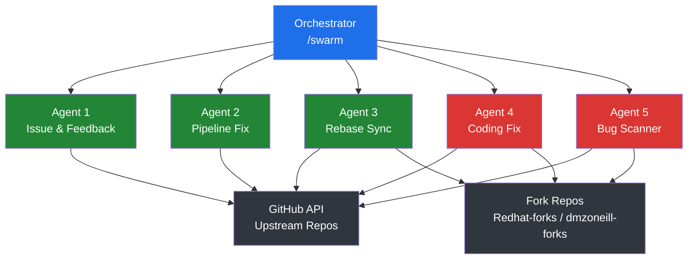
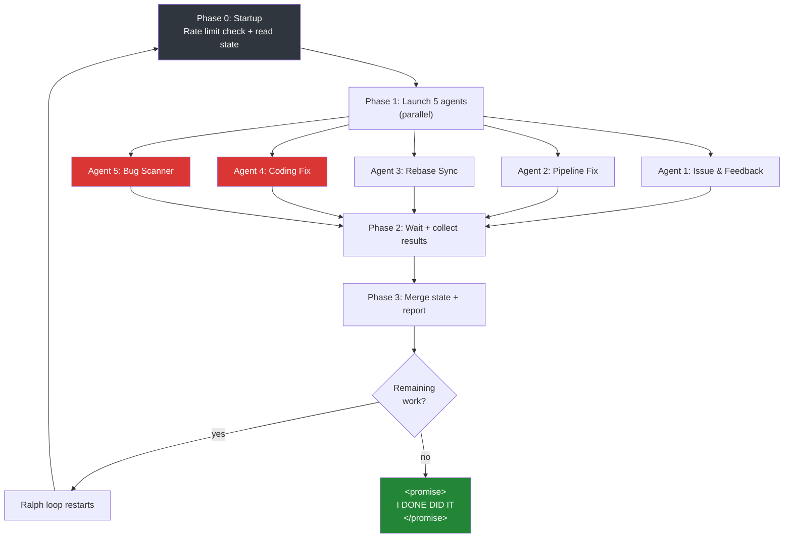

# CLAUDE.md

This file provides guidance to Claude Code (claude.ai/code) when working with code in this repository.

## What This Project Is

`github-ai-contributor` is a prompt-driven, headless AI system that autonomously contributes to open-source repositories. It monitors repos forked into the `Redhat-forks` and `dmzoneill-forks` GitHub orgs, scans their **upstream** (original) repos for open issues, assesses whether it can fix them with >= 90% confidence, and submits PRs back to the upstream. It also suggests features. Runs every 3 hours via GitHub Actions (1-hour timeout per run, separate workflows per org), fully headless using `claude -p`.

This project contains **no Python/Node code** — it is entirely orchestrated by Claude Code via markdown prompts, following the same architecture as `github-ai-maintainer`.

## How It Differs From github-ai-maintainer

`github-ai-maintainer` works on repos we **own** (dmzoneill's repos). This project works on **other people's repos** via forks:

1. Repos are already forked into the `Redhat-forks` or `dmzoneill-forks` org
2. We scan the **upstream** (original) repo for open issues
3. We **rebase our fork from upstream** to ensure we have the latest code
4. We create a branch **from upstream's default branch** (not origin's — the fork may have unsynced commits) named after the issue ID (e.g. `fix/issue-42-description`)
5. We implement the fix, ensuring commits pass **commitlint** validation
6. We push the branch to **our fork** (same branch name)
7. We create a PR from our fork's branch to the upstream repo's default branch
8. We **monitor the PR for its entire lifetime**:
   - Address reviewer feedback by pushing new commits
   - Fix any CI/pipeline failures that arise on the PR
   - Respond to comments
   - Stop tracking only when merged or closed

## Target Organizations

| Org | Description |
|---|---|
| `Redhat-forks` | Forks of Red Hat ecosystem projects |
| `dmzoneill-forks` | Personal forks of open-source projects |

## Contributor Identity

- PRs are submitted as the authenticated GitHub user (via `GITHUB_TOKEN` / `PROFILE_HOOK`)
- All contributions are respectful and follow upstream project conventions
- We read CONTRIBUTING.md, CODE_OF_CONDUCT.md, and any upstream guidelines before contributing

## Architecture

### Prompt-Driven Orchestration

No application code. Behavior is defined entirely by:
- `CLAUDE.md` — this file (project spec and rules)
- `.claude/commands/` — slash commands (orchestration logic)
- `.claude/skills/` — agent skill definitions
- `.claude/.swarm-state.json` — persistent state across runs
- Ralph-loop plugin for multi-iteration persistence

### 5 Parallel Agents

The orchestrator (`/swarm`) spawns 5 specialized Task agents that run in parallel:



**Agent 1 — Issue & Feedback**: Suggests features on upstream repos, follows up on comments/reviews on our open PRs, responds to reviewer feedback, implements requested code changes.

**Agent 2 — Pipeline Fix**: Monitors CI/pipeline status on our open PRs. If CI is failing, fetches logs, diagnoses failures, fixes code, pushes fix commits. Handles merge conflicts by rebasing from upstream.

**Agent 3 — Rebase Sync**: Keeps all forks synced with upstream. Clones/pulls each fork, adds upstream remote, fetches upstream, rebases default branch, pushes to fork.

**Agent 4 — Coding Fix**: The main worker. Scans upstream repos for open issues, assesses confidence, creates branches, implements fixes, runs tests, commits with conventional messages, pushes to fork, creates PRs to upstream. Balances work across repos.

**Agent 5 — Bug Scanner**: Proactively scans upstream codebases for critical bugs (security vulnerabilities, null dereferences, resource leaks, etc.). Opens a bug report issue on upstream, then implements the fix and creates a PR referencing that issue. Max 1 bug fix PR per repo, scans 20 repos per iteration. Tracks all reported bugs in state to avoid duplicates.

### Orchestration Flow



## PR Lifecycle — Full Ownership

We own every PR from creation to merge/close:

1. **Create**: Branch from latest upstream, implement fix, push to fork, open PR
2. **Monitor**: Check for reviewer comments, CI status, merge conflicts every iteration
3. **Respond**: Address all reviewer feedback — never leave a comment unanswered
4. **Fix CI**: If pipeline fails on our PR, diagnose and fix it
5. **Rebase**: If merge conflict, rebase from upstream and force-push to fork branch
6. **Close**: Stop tracking when PR is merged or closed by upstream maintainer

## Confidence Assessment

Before attempting to fix an issue, the Coding Agent assesses confidence:

- **>= 90%**: Proceed with fix
- **< 90%**: Skip the issue, add to `skipped_issues` in state with reason

Factors that increase confidence:
- Clear error message or stack trace in the issue
- Small, well-scoped bug (null check, off-by-one, missing import)
- Good test coverage in the repo (can verify fix)
- Simple codebase structure

Factors that decrease confidence:
- Vague issue description ("it doesn't work")
- Large architectural changes needed
- No test suite to verify against
- Complex multi-file changes
- Issue requires domain expertise we lack

## Balanced Distribution

To avoid overwhelming any single upstream repo:

1. Sort repos by current open PR count (ascending)
2. Round 1: 1 PR per repo before any repo gets 2
3. Round 2: 2 per repo before any gets 3
4. **Max 4 open PRs per upstream repo**
5. Max 50 fix attempts per iteration

## Commitlint

All commits must be conventional commit format:

```
fix: handle null pointer in parser (fixes #42)
feat: add retry logic to HTTP client
chore: update dependencies
docs: improve API documentation
test: add unit tests for auth module
refactor: simplify error handling in router
```

Structure: `type(optional-scope): description`

Valid types: `fix`, `feat`, `chore`, `docs`, `test`, `refactor`, `perf`, `style`, `build`, `ci`, `revert`

## Feature Suggestions

- Suggest at least 1 feature per upstream repo (as a GitHub issue) if not already suggested
- **Max 2 open feature suggestions per upstream repo** — do not create more if at limit
- Feature suggestions should be genuinely useful, well-reasoned, and specific
- Track suggestions in `feature_suggestions` array in state file
- **Never work on our own suggestions** — they are for the community, not for us
- If a suggestion is already open, don't duplicate it

## State File

`.claude/.swarm-state.json` has two sections:

- **persistent**: Survives across GitHub Actions runs. Tracks PRs, issues, suggestions, and cached knowledge — the bot's long-term memory.
- **last_run**: Overwritten each run. Tracks what happened in the most recent run.

The orchestrator reads persistent state at startup, passes relevant data to agents, then writes back updated state.

### Cached Knowledge

To avoid redundant API calls and re-analysis across runs, the state file caches:

- **`repo_profiles`**: Per-repo metadata discovered during scanning. Keyed by upstream `owner/repo`. Cached on first discovery, refreshed when the rebase agent detects upstream changes.
  ```json
  {
    "owner/repo": {
      "language": "Python",
      "default_branch": "main",
      "description": "A CLI tool for managing containers",
      "topics": ["cli", "containers", "devops"],
      "build_system": "makefile",
      "test_command": "make test",
      "lint_command": "make lint",
      "has_contributing_md": true,
      "has_tests": true,
      "project_type": "python-pipenv",
      "key_conventions": "Uses black formatting, pytest, type hints throughout",
      "last_profiled": "ISO-8601"
    }
  }
  ```

- **`evaluated_issues`**: Per-issue evaluation results. Keyed by `"owner/repo#number"`. Prevents re-reading and re-assessing issues across runs.
  ```json
  {
    "owner/repo#42": {
      "title": "Null pointer in parser",
      "confidence": 95,
      "decision": "fix_attempted",
      "reason": "Clear stack trace, single-file fix, good test coverage",
      "evaluated_at": "ISO-8601"
    },
    "owner/repo#15": {
      "title": "Refactor authentication",
      "confidence": 40,
      "decision": "skipped",
      "reason": "Requires multi-file architectural change, no test suite",
      "evaluated_at": "ISO-8601"
    }
  }
  ```

- **`bug_fixes`**: Array of bug fix PRs created by the Bug Scanner agent. Tracks both the bug report issue and the fix PR per entry, keyed by upstream repo + file path to prevent duplicate reports across runs.
  ```json
  [
    {
      "upstream": "owner/repo",
      "fork": "Redhat-forks/repo",
      "issue_number": 99,
      "pr_number": 55,
      "branch": "fix/bug-99-sql-injection-user-handler",
      "title": "fix: sanitize user input in SQL query",
      "file_path": "src/handlers/user.py",
      "line_number": 142,
      "bug_type": "sql_injection",
      "severity": "critical",
      "status": "open"
    }
  ]
  ```

Agents MUST check these caches before doing expensive operations (cloning repos, reading READMEs, evaluating issues). Write back any new discoveries.

## Slash Commands and Skills

### Commands (`.claude/commands/`)

| Command | Description |
|---|---|
| `/swarm` | Main orchestration — launches 5 agents in parallel |
| `/unleash` | Ralph-loop launcher — runs `/swarm` continuously |

### Skills (`.claude/skills/`)

| Skill | Agent | Description |
|---|---|---|
| `issue-feedback` | Agent 1 | Feature suggestions + PR comment follow-up |
| `pipeline-fix` | Agent 2 | Fix CI failures on our open PRs |
| `rebase-sync` | Agent 3 | Keep forks synced with upstream |
| `coding-fix` | Agent 4 | Identify issues, write fixes, create PRs |
| `bug-scanner` | Agent 5 | Scan codebases for critical bugs, report and fix them |

## Environment Variables

| Variable | Purpose |
|---|---|
| `GITHUB_TOKEN` | GitHub API access (repos, issues, PRs, forks) |
| `CLAUDE_CODE_USE_VERTEX` | Enable Vertex AI backend |
| `ANTHROPIC_VERTEX_PROJECT_ID` | GCP project for Vertex |
| `CLOUD_ML_REGION` | GCP region |
| `GOOGLE_APPLICATION_CREDENTIALS` | Path to GCP credentials JSON |

## Safety Rails

- **IMPORTANT: All rate limits and caps below apply ONLY to creating NEW PRs, issues, and feature suggestions.** Following up on existing PRs/issues (responding to reviewer comments, fixing CI failures, rebasing, addressing requested changes) is NEVER rate limited — always process ALL follow-up work regardless of limits.
- **Max 4 new open PRs per upstream repo**, balanced across repos
- **90% confidence threshold** before attempting fixes
- **Never force push to upstream** — only to our fork branch for conflict resolution
- **All commits must pass commitlint** validation (conventional commit format)
- **Rate limit monitoring** — stop if < 200 remaining during execution, don't start if < 500
- **Max 50 fix attempts per iteration**
- **Max 40 ralph-loop iterations**
- **Never modify files outside the fix scope**
- **Run tests before pushing** (if available)
- **Respectful PR descriptions** — contributing to others' projects
- **Always branch from `upstream/{default_branch}`** — never from `origin/{default_branch}` (forks may have unsynced commits that would pollute the PR diff)
- **Monitor and address ALL feedback** on our PRs — never abandon an open PR
- **Fix CI/pipeline failures** on our PRs proactively
- **Never work on issues we created ourselves** — feature suggestions are for the community
- **Max 1 bug fix PR per upstream repo** — bug scanner scans 20 repos per iteration, checks existing issues before reporting, checks existing issues before reporting
- **Read CONTRIBUTING.md** and upstream conventions before contributing
- **Never push more than 20 fix commits per iteration**
- **Track everything in state file** so next iteration doesn't redo work
- **Never mention Claude, Anthropic, or AI in commits, PRs, issues, or comments** — no Co-Authored-By headers, no AI attribution, no references to being an AI agent anywhere in contributions

## Project Structure

```
github-ai-contributor/
├── CLAUDE.md                              # This file — master specification
├── version                                # v0.0.1
├── LICENSE                                # Apache 2.0
├── .claude/
│   ├── .swarm-state.json                  # Persistent state across runs
│   ├── commands/
│   │   ├── swarm.md                       # Main orchestration — launches 5 agents
│   │   └── unleash.md                     # Ralph-loop launcher
│   └── skills/
│       ├── issue-feedback/
│       │   └── SKILL.md                   # Agent 1: issues, features, PR follow-up
│       ├── pipeline-fix/
│       │   └── SKILL.md                   # Agent 2: fix CI failures on our PRs
│       ├── rebase-sync/
│       │   └── SKILL.md                   # Agent 3: rebase forks from upstream
│       ├── coding-fix/
│       │   └── SKILL.md                   # Agent 4: identify issues, write code, create PRs
│       └── bug-scanner/
│           └── SKILL.md                   # Agent 5: scan for critical bugs, report and fix
├── .github/
│   └── workflows/
│       ├── main.yml                       # CI/CD (dispatch.yaml pattern)
│       ├── contribute.yml                 # Redhat-forks — every 3 hours
│       └── contribute-dmz.yml            # dmzoneill-forks — every 3 hours (offset)
└── .gitignore
```

## Conventions

- No application code — entirely prompt-driven via Claude Code
- Version file format: `version=X.Y.Z` in `./version`
- Single-branch git model on `main` for this repo
- Fork branches use pattern: `fix/issue-{number}-{short-description}`
- All commits to upstream repos use conventional commit format
- State file committed back after every GitHub Actions run
