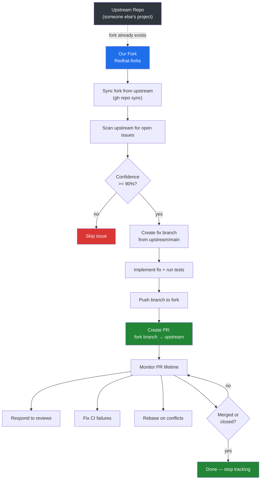
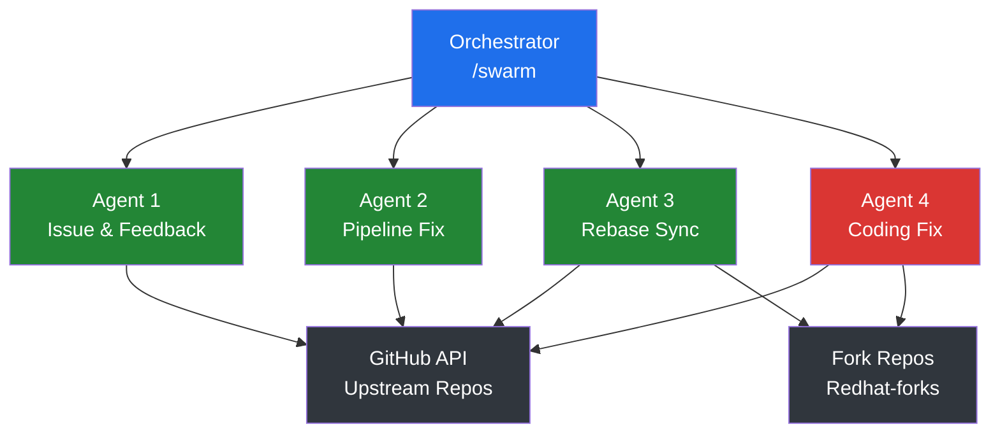
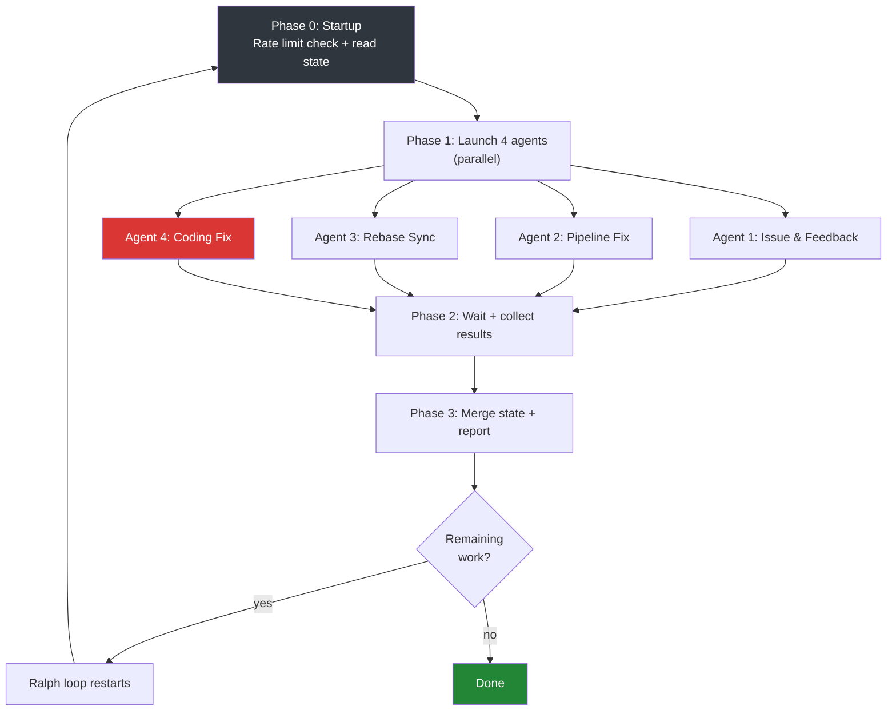

# github-ai-contributor

Prompt-driven, headless AI system that autonomously contributes to open-source repositories. It monitors repos forked into the [`Redhat-forks`](https://github.com/Redhat-forks) GitHub org, scans their upstream repos for open issues, assesses whether it can fix them with >= 90% confidence, and submits PRs back to the upstream. It also suggests features.

Runs every 3 hours via GitHub Actions (1-hour timeout per run), fully headless using `claude -p`. Contains **no application code** — entirely orchestrated by [Claude Code](https://claude.ai/code) via markdown prompts.

## How It Works



## Architecture

Four specialized agents run in parallel, coordinated by an orchestrator:



| Agent | Role |
|---|---|
| **Issue & Feedback** | Suggests features on upstream repos. Follows up on reviewer comments on our open PRs. |
| **Pipeline Fix** | Monitors CI status on our PRs. Diagnoses and fixes failures. Handles merge conflicts. |
| **Rebase Sync** | Keeps all forks synced with upstream via rebase. |
| **Coding Fix** | The main worker. Scans issues, assesses confidence, implements fixes, creates PRs. |

## Orchestration Flow



## Relationship to github-ai-maintainer

[`github-ai-maintainer`](https://github.com/dmzoneill/github-ai-maintainer) works on repos we **own** (dmzoneill's repos). This project works on **other people's repos** via forks. Same prompt-driven architecture, different target.

## Safety Rails

- **90% confidence threshold** before attempting any fix
- **Max 3 open PRs per upstream repo**, balanced across repos
- **Max 5 fix attempts per iteration**, max 20 iterations per run
- **Rate limit monitoring** — won't start if < 500 remaining, stops if < 200
- **Commitlint validation** on all commits (conventional commit format)
- **Never force push to upstream** — only to fork branches for conflict resolution
- **Runs tests before pushing** when available
- **Reads CONTRIBUTING.md** and upstream conventions before contributing
- **Full PR ownership** — monitors, responds to reviews, fixes CI, rebases on conflicts
- **Never works on self-created issues** — feature suggestions are for the community

## Project Structure

```
github-ai-contributor/
├── CLAUDE.md                     # Master specification for Claude Code
├── version                       # v0.0.1
├── LICENSE                       # Apache 2.0
├── .claude/
│   ├── .swarm-state.json         # Persistent state across runs
│   ├── commands/
│   │   ├── swarm.md              # Main orchestration (4 parallel agents)
│   │   └── unleash.md            # Ralph-loop launcher
│   └── skills/
│       ├── issue-feedback/       # Agent 1: features + PR follow-up
│       ├── pipeline-fix/         # Agent 2: CI failure diagnosis & fix
│       ├── rebase-sync/          # Agent 3: fork-to-upstream sync
│       └── coding-fix/           # Agent 4: issue fixing + PR creation
├── .github/workflows/
│   ├── contribute.yml            # Every 3 hours via cron
│   └── main.yml                  # CI/CD dispatch wrapper
└── .gitignore
```

## Running

### Automated (GitHub Actions)

The `contribute.yml` workflow runs every 3 hours with a 1-hour timeout. It can also be triggered manually via `workflow_dispatch`.

### Manual (Claude Code CLI)

```bash
# Run the full swarm once
claude -p "/swarm"

# Run continuously until all work is done
claude -p "/unleash"
```

## Environment Variables

| Variable | Purpose |
|---|---|
| `GITHUB_TOKEN` / `PROFILE_HOOK` | GitHub API access |
| `CLAUDE_CODE_USE_VERTEX` | Enable Vertex AI backend |
| `ANTHROPIC_VERTEX_PROJECT_ID` | GCP project for Vertex |
| `CLOUD_ML_REGION` | GCP region |
| `GOOGLE_APPLICATION_CREDENTIALS` | Path to GCP credentials JSON |

## License

Apache 2.0 - see [LICENSE](LICENSE).
